# Database Sharding Example with Go and MongoDB

This project is a practical demonstration of **application-level sharding**, a technique used to horizontally scale databases. The Go application manages the data distribution across multiple MongoDB databases (shards) based on a sharding key.

The goal is to illustrate the fundamental concepts, advantages, and challenges of a sharded architecture, such as "scatter-gather" queries.

## Architecture


The architecture is simple yet powerful:

1.  A **Client** makes an HTTP request to the Go API.
2.  The **Go API** acts as a smart router. It contains the **Sharding Logic**.
3.  Based on the user's `id`, the logic calculates which MongoDB **Shard** should be used.
4.  The operation (read, write, etc.) is executed directly on the correct shard.
5.  For operations that don't use the sharding key (like searching by name), the API queries all shards in parallel and aggregates the results.


## Sharding Logic

Data distribution is performed using **Hash Sharding**. The chosen sharding key is the user's `id` (UUID).

The `getShardIndex(id)` function in `sharding.go` implements this logic:
1.  The user's UUID is converted to its byte representation.
2.  A fast hash algorithm (FNV-1a) generates a unique number from these bytes.
3.  The modulo operator (`%`) is applied to the hash with the total number of shards (4).
    `shard_index = hash(id) % 4`
4.  The result (0, 1, 2, or 3) determines the exact shard where the data will be stored or queried, ensuring a statistically uniform distribution.


## Prerequisites
* **Docker** & **Docker Compose**
* **Go**

## How to Run the Project

1.  **Clone the repository** or create all files from the project structure.

2.  **Initialize the Go modules for the main API:**
    ```bash
    cd app
    go mod init go-sharding-mongo/app
    go mod tidy
    cd ..
    ```

3.  **Spin up the infrastructure** with Docker Compose:
    ```bash
    docker compose up --build
    ```
    This command will start the 4 MongoDB shards and the Go application.

## How to Run the Automated Tests

The project includes a Go test client (`test_client/`) that validates the entire architecture's functionality.

1.  Ensure the project's infrastructure from the previous step (`docker compose up`) is running.
2.  Open a **new terminal**.
3.  **Navigate to the test client directory and initialize its modules:**
    ```bash
    cd test_client
    go mod init go-sharding-mongo/test_client
    go mod tidy
    ```
4.  **Run the test program:**
    ```bash
    go run .
    ```

**What the test script does:**
1.  Inserts 1000 users in parallel into the API.
2.  Connects directly to each MongoDB shard to count the documents and verify the data distribution.
3.  Executes a full CRUD flow: creates, reads, updates, and deletes a test user.
4.  Tests the "scatter-gather" query by searching for a name that exists in multiple shards.
5.  Tests failure cases by ensuring the API correctly responds to requests for non-existent IDs.

## API Endpoint Analysis

* `POST /users`: Creates a new user. The sharding logic determines which of the 4 shards it will be saved to.
* `GET /users/{id}`: Fetches a user. The sharding logic calculates the exact shard, and the query is made against only **one** database. This is a very efficient operation.
* `PUT /users/{id}`: Updates a user. An efficient operation as it targets a single shard.
* `DELETE /users/{id}`: Deletes a user. An efficient operation as it targets a single shard.
* `GET /users/name/{name}`: Fetches users by name. Since `name` is not the sharding key, the API **does not know** where the data is. It must query **all 4 shards in parallel** and combine the results. This is a "scatter-gather" operation and is inherently less efficient.

## Limitations and Discussion Points

* **Inefficient Queries:** Any query that does not use the sharding key (`id`) will require a scan across all shards.
* **Transactions:** There is no support for ACID transactions that span multiple shards.
* **Rebalancing (Re-sharding):** Adding a new shard (e.g., a 5th) to this system would require complex manual logic to migrate a portion of the data from existing shards to the new one, a process known as rebalancing.