# Example of Multi-Tier Load Balancer Architecture

This project is a practical demonstration of a microservices architecture with multiple load balancing tiers, using modern technologies like Go, Docker, NGINX, and HAProxy.

The goal is to illustrate how requests can be distributed across different layers of an application, from the Edge to internal services, ensuring scalability and resilience.

## Architecture



The request flow follows this path:

1. The user sends a request to the system's entry point.

2. NGINX acts as an Edge Load Balancer (or API Gateway), receiving the request and distributing it among one of the 4 nodes in the Controller layer.

3. The Controller node that receives the request needs data. It makes a call to the next level, targeting HAProxy.

4. HAProxy acts as an Internal Load Balancer, receiving the request from the Controller and distributing it among one of the 4 nodes in the Repository layer.

5. The Repository node executes the data access logic by querying the PostgreSQL database.

6. The response follows the path back to the user.

## Project Structure

```
load-balancer

├── docker-compose.yml
├── controller_api # Microservice (Receives the request and passes it to the next layer)
│   ├── Dockerfile
│   ├── go.mod
│   └── main.go
├── repository_api # Microservice (Queries the database)
│   ├── Dockerfile
│   ├── go.mod
│   ├── go.sum
│   └── main.go
├── nginx
│   └── nginx.conf # Edge Load Balancer configuration
├── haproxy
│   └── haproxy.cfg # Internal Load Balancer configuration
├── init.sql # Initial database script
└── README.md
```

## Prerequisites

* Docker

* Docker Compose

* Go (required to initialize modules)

## How to Run

1. Clone the repository (or make sure all files listed above are in place).

2. Initialize the Go modules to download required dependencies before building Docker images.

   ```bash
   # For the repository API
   cd repository_api
   go mod tidy
   cd ..

   # For the controller API
   cd controller_api
   go mod tidy
   cd ..
   ```

3. Spin up the entire infrastructure using Docker Compose.

   The following command will build the images and create 4 replicas of each API service, as defined in the architecture.

   ```bash
   docker-compose up --scale controller_api=4 --scale repository_api=4
   ```

## How to Test

After executing the `up` command, all 11 containers will be running. To see load balancing in action:

1. Open a new terminal.

2. Run the command below to make continuous requests to the system every second. The `-i` flag is used to show the response headers.

   ```bash
   # For Linux/macOS
   while true; do curl -i http://localhost:8080/data; echo; sleep 1; done
   ```

3. Observe the output!

   * The `X-Controller-Node-ID` header in the response will vary, showing that NGINX is distributing the load.

   * The `repository_node_id` field in the JSON body will also vary, showing that HAProxy is doing its job.

## Demonstrated Concepts

* **Edge Load Balancer**: Using NGINX as the single entry point (API Gateway) for the system.

* **Internal Load Balancer**: Using HAProxy to manage internal service-to-service communication.

* **Multi-Tier Architecture**: Separating the application into layers with distinct responsibilities (presentation/logic, data access).

* **Horizontal Scalability**: The ability to increase the number of service replicas to handle more load.
